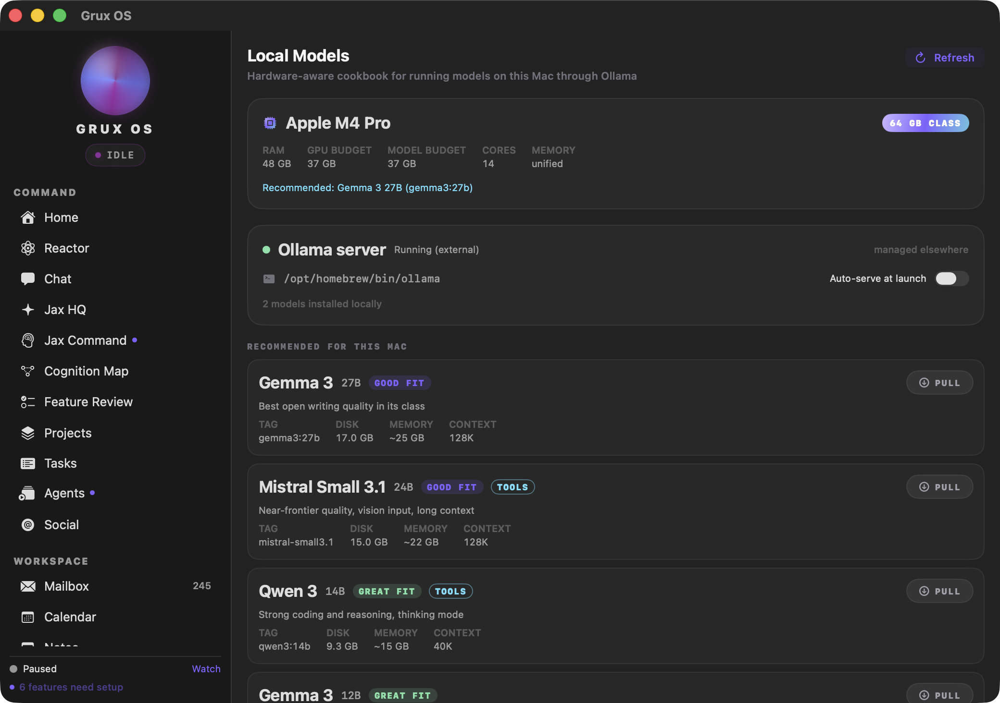
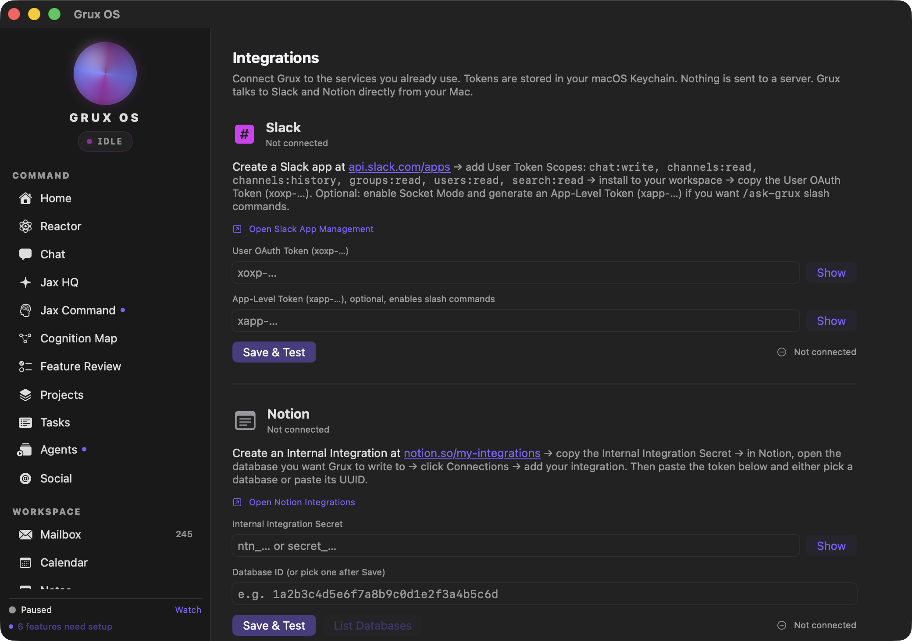

# Grux

**The god agent for solopreneurs on Mac.**

Thirty nine features and one hundred sixteen tools in one native window.

Grux opens persistent terminal sessions in your project and can undo anything it
did, because every command is snapshotted into a shadow git repository first. It
runs swarms of agents in parallel. It scaffolds, builds and runs iOS apps in the
simulator. It drives your screen when clicking is faster than describing. It
captures meetings, tells the speakers apart on device, and files the transcript.
And it reads its own source, proposes its next version, builds it, verifies it,
and waits for you to approve the install.

The mail, calendar, contacts, notes, documents and meetings already on your Mac
are the easy part, and it does those too.

It talks to a model you pay for directly, or to a local model with no key at all.
There is no Grux account, no Grux server, and no subscription. Your key, your
machine, your data.

If it earns it, a star is the whole ask.

**Status: shipping, currently 1.2.1.** 39 features ship, and a command line drives all of them. 25 are core and 14 are
labelled BETA in the sidebar because they are real but rough. Nothing is hidden
behind a waitlist. See [Feature tiers](#feature-tiers) for exactly which is which.



Grux reads your hardware and tells you which local models actually fit it, so you
can run the whole thing without sending a token to anyone.



Credentials go to your Keychain and services are called directly from your
machine. There is no server in the middle because there is no server.

These are the real interface, not mockups. Two surfaces rather than a gallery,
because the rest of the app is full of the author's own mail and calendar and
those are not yours to look at.

---

## Table of contents

- [What it actually does](#what-it-actually-does)
- [The command line](#the-command-line)
- [What it costs](#what-it-costs)
- [Requirements](#requirements)
- [Building](#building)
- [First run](#first-run)
- [Permissions, and what each one buys](#permissions-and-what-each-one-buys)
- [Privacy posture](#privacy-posture)
- [Feature tiers](#feature-tiers)
- [The phone companion](#the-phone-companion)
- [Repository layout](#repository-layout)
- [Tests](#tests)
- [Who made this](#who-made-this)
- [Security](#security)
- [Contributing](#contributing)
- [License](#license)

---

## What it actually does

The short version: one window, a sidebar of surfaces, and an assistant that can
reach the things a Mac assistant should be able to reach.

- **Chat** with tool use, against Anthropic or a local model.
- **Local models** through Ollama, so you can run the whole thing without sending
  a token to anyone.
- **Mailbox, Calendar, Contacts, Notes, Documents** against your real accounts,
  not a hosted copy of them.
- **Meetings** that record both the microphone and system audio, transcribe on
  device with WhisperKit, and never upload the raw audio.
- **Projects, Task Stack, Schedules, Skills, Commands** for the work around the
  work.
- **Research** over the web, with a search key you supply.
- **A shell** that runs real commands behind a path allowlist, a command
  denylist, a rate limit, and an audit log.
- **Approvals**, which is where anything sensitive stops and waits for you.

Every one of those is a real surface in the app. None of them is a stub.

## The command line

Grux can be set up and driven entirely from the terminal, without opening a
window. Shipped in 1.2.0, and the reason is not that a terminal is faster.

It is that the coding agent already sitting in that terminal can do the work
with you: install Grux, wire it into the rest of your machine, and go on
extending it long after setup is done.

Start here. One command, nothing to install first:

```sh
npx @dotcomjack/grux
```

That finds Grux.app, puts `grux` on your PATH, and runs setup. After the first
run, drop the `npx`. The launcher is a dependency free shim that only locates
the binary and steps aside, so there is one implementation of everything below
and no second front door to drift. Details in [npm/README.md](npm/README.md).

The binary itself lives at `Grux.app/Contents/MacOS/grux-cli`, so you can link
it by hand instead if you prefer:

```sh
ln -s /Applications/Grux.app/Contents/MacOS/grux-cli ~/.local/bin/grux
```

```sh
grux setup                 # the whole first run, unattended
grux status --json         # what is configured, what is missing
grux doctor                # what is wrong, and what to do about it
grux why <feature>         # why a feature says it needs setup
```

- **Every command runs unattended.** A flag for every choice and JSON on every
  read, so nothing hangs waiting for a prompt an agent cannot see.
- **Every command can print itself as a prompt** instead of running, so you can
  hand the job to whichever coding agent you already use rather than translating
  it yourself.
- **An MCP bridge**, so an agent that speaks it can drive Grux through the same
  tools you do.
- **Reads answer with Grux closed.** They come from files on disk. Writes go over
  a Unix socket at `0600`, so Grux still opens no network port.

The full surface, every command and every exit code, is in
[Grux-Mac/docs/cli-grammar.md](Grux-Mac/docs/cli-grammar.md).

## What it costs

Nothing, to Grux. It is MIT licensed and there is no hosted component.

You pay your model provider directly, at their prices, on your own account. Grux
never proxies a request through anything we run, so there is no markup and no
middleman with a copy of your prompts.

If you run a local model through Ollama, it costs nothing at all.

## Requirements

- macOS 14 (Sonoma) or later, Apple silicon
- Xcode 16 or later (Swift 6.0+). `Package.swift` says `swift-tools-version:5.9`,
  but `swift-transformers` pulls `swift-jinja` 2.x, which is written against
  tools-version 6.0, so an older toolchain cannot resolve the dependency graph
- An Anthropic API key, or Ollama running locally

Dependencies are deliberately thin. The only direct one is
[WhisperKit](https://github.com/argmaxinc/WhisperKit) for on-device speech, which
pulls in Apple's own packages plus HuggingFace's `swift-transformers`. There is no
analytics SDK, no crash reporter, and no telemetry package in the tree. You can
check that yourself in `Grux-Mac/Package.resolved`.

## Building

```sh
git clone https://github.com/dotcomjack/grux.git
cd grux/Grux-Mac
./build.sh
```

That builds a release binary, assembles `Grux.app`, signs it, installs it to
`/Applications`, and opens it.

**On signing.** macOS keys every permission grant to the signing identity, so
`build.sh` pins one to stop the app re-prompting on every rebuild. If you do not
have that certificate, and you will not, it falls back to an ad hoc signature and
says so. The app runs fine; you will just re-grant permissions after a rebuild.
Set `GRUX_SIGN_ID` to your own identity hash to make grants stick:

```sh
security find-identity -v -p codesigning        # find yours
GRUX_SIGN_ID=<your-identity-hash> ./build.sh
```

**Distributable builds.** `GRUX_RELEASE=1 ./build.sh` signs with a
`Developer ID Application` certificate and writes the artifact to your Desktop
without installing it, because signing with a different identity would revoke the
dev install's permission grants.

Add `GRUX_NOTARIZE=1` to notarize and staple. Authentication is either an App
Store Connect API key, which is preferred because it works unattended:

```sh
GRUX_RELEASE=1 GRUX_NOTARIZE=1 \
  ASC_KEY=~/private_keys/AuthKey_XXXXXXXXXX.p8 \
  ASC_KEY_ID=XXXXXXXXXX ASC_ISSUER=<issuer-uuid> ./build.sh
```

or an Apple ID with an app-specific password, via `APPLE_ID`,
`APPLE_APP_PASSWORD` and `APPLE_TEAM_ID`. Apple notarizes only Developer ID
signed code, so `GRUX_NOTARIZE=1` without `GRUX_RELEASE=1` is refused rather than
uploaded and rejected.

## First run

**The minimum useful setup is one key.** Chat needs an Anthropic API key and
nothing else. Paste it in Settings and the app is usable.

Everything beyond that is opt in, and the app tells you what is missing rather
than failing quietly. Each sidebar row carries a dot when a feature it depends on
is unconfigured, and the setup sheet names the specific credential, permission or
step that is absent. A feature you never open never asks you for anything.

If you would rather not send anything to a hosted model at all, install
[Ollama](https://ollama.com), pull a model, and Grux will use it. The Local Models
tab picks it up automatically.

Credentials go to the macOS Keychain under the service `com.gruxai.grux`. They are
never written to disk in plaintext and never leave the machine except to the
provider they belong to.

## Permissions, and what each one buys

Grux asks for a lot, because it does a lot. Every one of these is optional, every
one is requested only when you first use the feature that needs it, and refusing
one disables exactly that feature and nothing else.

| Permission | What stops working without it |
|---|---|
| Microphone | Meetings (required). Voice input in Chat and Reactor |
| System audio recording | Meetings (required). This is the other half of the call, not your mic |
| Screen recording | Focus log and Terminal Focus (required). Screen context in Chat |
| Calendar | The Calendar tab (required). Agenda on Home, Chat calendar tools |
| Contacts | The Contacts tab (required). Contact lookup in Chat |
| Automation (AppleEvents) | Commands and Terminal Focus. App control from Chat |
| Accessibility | Focus log. Window and selection awareness in Chat |
| Notifications | Schedules, Workflows and Focus log alerts |
| Full disk access | Jax Command only. Never required |

The table above is derived from the same feature registry the app reads at
runtime, so it cannot drift from the real behaviour.

**Grux is not sandboxed.** ScreenCaptureKit, AppleEvents and cross app microphone
access are not available inside the App Sandbox, so the OS level path allowlist is
not available either. The filesystem boundary is therefore enforced in Swift, in
one file, and that file is the only path from the model to your disk. It carries a
read only root allowlist, a denylist covering `.ssh`, `.aws`, `.env`, the Keychain,
Mail, Messages and browser profiles, a size cap, a rate limit, a secret pattern
scan on everything it returns, and an audit log. That trade is written up in full
in [SECURITY.md](Grux-Mac/SECURITY.md), including the parts it does not defend
against.

## Privacy posture

- **No account.** There is nothing to sign up for.
- **No server.** There is no Grux backend. Nothing is proxied.
- **No telemetry.** No analytics SDK, no crash reporter, no usage beacon. Grep the
  tree.
- **Your keys stay in your Keychain**, and go only to the provider they belong to.
- **Meeting audio is transcribed on device.** The recording does not leave the
  machine.
- **Everything the model reads from disk is logged** to
  `~/Library/Application Support/Grux/fs-audit.log`, including the denials. You
  can read it at any time and it is plain text.

The one thing to be clear eyed about: when you use a hosted model, that provider
sees what you send it. Grux redacts secrets it recognises before anything goes
out, but a hosted model is a third party by definition. Run Ollama if that matters
to you.

## Feature tiers

**Core (25).** Home, Chat, Approvals, Cognition Map, Projects, Task Stack,
Mailbox, Calendar, Notes, Documents, Contacts, Schedules, Folders, Research,
Skills, Compare, Local Models, Design Studio, Meetings, Speakers, Commands, Focus
log, Integrations, Outbound Webhooks, Settings.

**Labs (14), badged BETA in the sidebar.** Reactor, Jax Command, Feature Review,
Agents, Compose and send, Media Studio, Social, Workflows, Terminal Focus,
Self-Upgrade, Jax HQ, Meta Ads, Domain monitor, Phone companion.

Labs does not mean broken. It means the surface is real and the edges are not
sanded. A test asserts that every labs feature is badged and that no core feature
is, so the label cannot quietly go stale.

## The phone companion

`GruxPhone/` is a small iOS app that pairs with the Mac over your local network
and acts as a remote microphone and control surface. The link is
Curve25519 key exchange, ChaCha20-Poly1305 encryption and HMAC authentication, and
traffic never leaves your LAN.

It is a labs feature and it is opt in. If you never pair a phone, the Mac never
opens a listening socket.

## Repository layout

```
Grux-Mac/            the macOS app (Swift package, builds Grux.app)
  Sources/Grux/      the app itself
  Sources/GruxShellCore/    PTY shell, safety gates, snapshot store, no UI
  Sources/GruxAgentCore/    agent orchestration, no UI
  Sources/GruxMCPServer/    read only MCP server for external agents
  Tests/GruxTests/   the suite
  docs/              the setup contract and its change record
  scripts/           the frozen-contract checker
  SECURITY.md        the threat model, in full
GruxPhone/           the iOS companion
```

`GruxShellCore` and `GruxAgentCore` are deliberately free of AppKit and SwiftUI, so
they can be used and tested without the UI stack.

## Tests

```sh
cd Grux-Mac
swift test
```

Be aware that `swift build` does **not** compile the test target, so a green build
is not a green suite. The suite includes guards that are unusual and worth knowing
about before you touch them:

- The **setup contract** is frozen. `scripts/check-contract.py` fails if a
  capability changes meaning without a dated amendment in `docs/`.
- The **identity scan** fails on a personal name, address or account identifier
  anywhere in the shipping tree.
- The **dash guard** fails on an em dash or en dash anywhere that ships, comments
  included.
- Several guards **test themselves**, by planting the thing they detect and
  asserting they catch it. A guard that cannot fail is not a guard.

## Who made this

I have been building and shipping my own products since 2015. Right now that is
about a dozen of them, run by one person, from Detroit.

That is the reason this exists. Running a dozen small products alone was never
bottlenecked on code. It was the hour a day spent moving between a mail client, a
calendar, a terminal and four chat tabs that could not see any of it. So I built the
assistant I actually wanted: one that reads the window I am already in, handles the
mail, and takes the meeting notes.

Eight of the thirty-nine surfaces in here are literally the tooling that runs my
businesses. They ship instead of getting deleted, because taking them out would
misrepresent what you are downloading.

It was a hobby project for six months. It is not a startup, there is no account, and
there is nothing to buy. I am open sourcing it because it got useful enough to be
worth somebody else's time, and because software that reads your screen and your mail
should be readable back.

Expect rough edges. Fourteen surfaces say BETA because they earned it. If something
breaks, open an issue and tell me what you were doing.

## Security

The threat model, the layered controls with file and line anchors, the denylist,
the audit log format, and an explicit section on what Grux does **not** defend
against are all in [SECURITY.md](Grux-Mac/SECURITY.md).

To report a vulnerability, see [SECURITY](.github/SECURITY.md). Please do not open
a public issue for anything exploitable.

## Contributing

Yes, please. [CONTRIBUTING.md](CONTRIBUTING.md) covers the frozen contract, the
house rules that are enforced by tests, and what a good pull request looks like
here. It is short and it will save you a round trip.

## License

MIT. See [LICENSE](LICENSE).

### Standing on other people's work

Grux links the software below, and each of those licences asks to travel with
it. MIT is permissive about what you may do with the code and not about the
notice: retaining it is the whole of the obligation. Six of these are Apache
2.0, which asks for more, including reproducing any NOTICE file.

The full licence text of every one of them, and the NOTICE files where they
exist, are in [THIRD-PARTY-NOTICES.md](THIRD-PARTY-NOTICES.md), which also ships
inside `Grux.app` so it reaches somebody who never opens this page. That file is
generated from `Grux-Mac/Package.resolved`, and a test fails if it drifts, so a
new dependency cannot ship uncredited.

| Package | Licence |
|---|---|
| [swift-argument-parser](https://github.com/apple/swift-argument-parser) | Apache 2.0 |
| [swift-asn1](https://github.com/apple/swift-asn1) | Apache 2.0 |
| [swift-collections](https://github.com/apple/swift-collections) | Apache 2.0 |
| [swift-crypto](https://github.com/apple/swift-crypto) | Apache 2.0 |
| [swift-jinja](https://github.com/huggingface/swift-jinja) | Apache 2.0 |
| [swift-transformers](https://github.com/huggingface/swift-transformers) | Apache 2.0 |
| [whisperkit](https://github.com/argmaxinc/WhisperKit) | MIT |
| [yyjson](https://github.com/ibireme/yyjson) | MIT |

Thanks in particular to [WhisperKit](https://github.com/argmaxinc/WhisperKit),
which is why meeting transcription runs on the machine and the audio never
leaves it.
